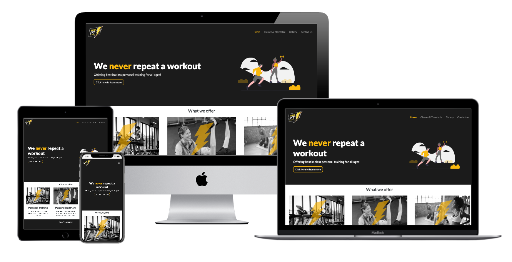

# ProPT Studios 

ProPT Studios is a professional personal training studio based in Clonee, Co Meath.

This website provides an overview of services, the team as well as studio location, classes timetable & contact 
 
## Live demo

Live demo of the website can be found at https://ib-skoric.github.io/ci-propt-studios/ 

## UX

### User stories

As a prospective client, I want to see what this gym offers, what do people say about it and who are the trainers.

As a prospective and current client, I wish to be able to view the time table and what classes the gym offers. 

As a prospective client, I want to contact the team because I have some additional questions.

As a supplier, I want to see what the gym offers and what services of mine I could offer & business contact details.

### Strategy

The main design goal is to make important information accessible to new/existing clients while maintaining a clean and modern look.

### Scope

For the prospective clients, the website offers insight into what the gym offers & who the trainers are. For the existing clients, the website offers information about the classes & offers currently available.

### Structure

The home page displays key 'features' of the gym under the 'What we offer' section.
This is followed by the testimonials of those that are current gym-goers.
After which the user can see who the trainers are and finally where the gym is located. 

Classes & timetable offers the user an overview of classes the gym currently does as well as the timetable for the week. Below this, the user can read frequently asked questions & their answers.

Contact us page provides a form for users to contact the trainers and to ask any additional questions regarding the gym and what it offers

### Skeleton

[Landing Page wireframe](assets/images/documentation/landing-wireframe.jpg)

[Classes & Timetable page wireframe](assets/images/documentation/classes-wireframe.jpg)

[Contact us wireframe](assets/images/documentation/contact-wireframe.jpg)

Gallery page was created after a middle project review with my mentor and design was done 'on-the-fly'.

### Surface

Colour scheme chosen for this project reflects the ProPT branding colours.

| Colour name       | Colour RGB Code    
| -------------     |:-------------:| 
| Dark Gunmetal     |#212529
| Mikado Yellow     |#FFB10
| White             |#FFFFF

Font used throughout is Google font's Lato - https://fonts.google.com/specimen/Lato 

## Features

### Existing Features

All pages feature a top navigation bar with a logo in the top-left corner, footer that contains the gym address, phone contact details & social media links. 
All pages feature a jumbotron with the gym's slogan 'We never repeat a workout'/page title and an appropriate illustration to the right. This illustration is only visible on desktop devices and is hidden on tablets and mobile devices. 

**Home Page**

What we offer section is divided into 3 sections - personal training, personalised plans & group classes each with a brief description. 
They've done it section features 3 user testimonials and their images.
Meet the trainers section features trainer images, short bios & social media links.
Where to find us section features a Google Maps map. 

**Classes & Timetable**

Our classes section is divided into 4 sections - cardio-focused, strength-focused, BroCamp & Teen Fit each with a brief description. 
Our timetable features image of the timetable with a button to open image in a new tab - this allows users to save it and view in full size if on a mobile device

**Gallery**

Gallery page features 5 different images of a yoga class, people doing workouts, gym equipment etc.

**Contact us**

Contact us page features a contact us form with a submit button and a Google Maps map. 

### Features Left to Implement

The idea is to implement a back-end for scheduling clients & bookings at a later date.

The Contact us form currently has no action, no email gets sent after the button is clicked. The idea is to implement automatic email sending to the trainer's emails after the user submits the form. The form would also ideally have some sort of CHAPTA authentification to prevent bots from doing random submits. 

After professional photographs are done, the stock photographs currently on the website would be replaced. Actual social media profile links of trainers have intentionally been left out.

## Technologies Used

1. HTML5
2. CSS3
3. [Bootstrap v4.4.1](https://getbootstrap.com/)
4. [Font Awesome](https://fontawesome.com/start)
5. JavaScript - *see Credits*
6. [Animate on Scroll (AOS)](https://github.com/michalsnik/aos)
7. [Google Fonts](https://fonts.google.com/)

## Testing

The user is presented with a landing (home) page. The website can be navigated using the navigation links at the top-right of the page. Call to action button in the jumbotron element scrolls down the page to the 'What we offer' section of the website. Image to the right in all jumbotrons is hidden on mobile to save precious horizontal viewport space. Scrolling down the page user can see user testimonials and scrolling further profiles of trainers with their short bios. Social media profile links are located under bios (these have been intentionally left out, refer to *Features Left to Implement* section). All of these links open in a new tab using _blank attribute. Scrolling down user is presented with a Google Maps map showing the gym location. The map is interactive and scales down well to all resolutions. 

Under Classes and Timetables page the user is presented with a range of classes the gym offers. Scrolling down, user can view the timetable which is presented in an image format. By clicking the button below the image, a new tab opens with the PNG image which user can save onto their device. 

The gallery page has no user interaction, animations of hidden from viewport images are achieved using Animate On Scroll library - refer to *Acknowledgements* section

Contact us page contains a contact us form with 5 elements - name (required), email (required), phone number (not required), drop-down selection of what the user's query relates to and a text field (required). If any of the required fields are left blank, the user is prompted to enter them again. Similarly, if the email address is in the wrong format (ie. missing @ sign) user will be prompted to enter a valid email address. Submit button currently has no action (refer to *Features Left to Implement* section)

There was a bug found an all devices where there was a bit of overflow due to the jumbotron element overflowing to the right. CSS properties were accordingly adjusted to fix this.

Additionally, after adding them initially, the animations would repeat themselves over and over again when the user scrolls up/down the page. This was fixed by adding `once: true` under the `AOS.init({}` - this solution was found under official documentation on GitHub.

This has been tested using (all on 13" Macbook Pro with macOS 10.15.3 + on an external 24" display):

+ Google Chrome 80.0.3987.132
+ Opera 67.0.3575.79
+ Firefox 74.0
+ Safari 13.0.5
+ Microsoft Edge for Mac 80.0.361.66

+ Google Chrome on Android (Samsung Galaxy S10+) 80.0.3987.149
+ Safari on iOSb 13.3.1 (Apple iPhone XR) 
+ Safari on iOS 8.1 (Apple iPad Air 2) 
+ Internet Explorer 10 - via https://www.ieonchrome.com/ 
+ Internet Explorer 11 - via https://www.ieonchrome.com/

The website has also been tested via the [W3C Markup Validation Service](https://validator.w3.org/) & [W3C CSS Validation Service](https://jigsaw.w3.org/css-validator/).

At first, the HTML validation was not passed due to the Google Maps iframe element having some inline CSS. This was fixed by moving the CSS to the style.css file.

## Deployment

This website has been deployed and is hosted on GitHub Pages. It has been deployed straight from *master* branch. This has been done by navigating to the repository > Clicking on *Settings* > Scrolling down to *GitHub Pages* section > Selecting *master branch* as a source. 

The page will update automatically with new/changed content once commits are pushed to the remote repo location using `git push` command. 

If you wish to clone this repository, this can be done using `git clone https://github.com/ib-skoric/ci-propt-studios.git`

## Credits

### Content

All textual content on the website has been written by me.

### Media

The logo has been sourced from [PrPT's Facebook page](https://www.facebook.com/proptstudios/)

Photos have been sourced from [Pexels](https://www.pexels.com/). 

SVG Illustrations used in jumbotrons have been sourced from [Undraw](https://undraw.co/illustrations). 

GIMP 2.10 Image editor has used to apply different effects to images & Sketch 61 for editing SVG files. 

### Acknowledgements

To animate elements Animate on Scroll library's been used - https://github.com/michalsnik/aos.

Code snippet tutorial on how to use inline JavaScript for a button to mimic link opening on click has been found [here](https://stackoverflow.com/questions/11620698/how-to-trigger-a-file-download-when-clicking-an-html-button-or-javascript).

Code snippet tutorial on how to use inline JavaScript for a button to scroll down to a certain section on the website has been found [here](https://stackoverflow.com/questions/16349490/html-css-buttons-that-scroll-down-to-different-div-sections-on-a-webpage).

Code for embedded Google Maps has been generated using [maps.ie Create a map tool](https://www.maps.ie/create-google-map/).

To create the showcase image shown under *live demo* section [techsini's Multidevice Mockup Generator](https://www.maps.ie/create-google-map/)'s been used.